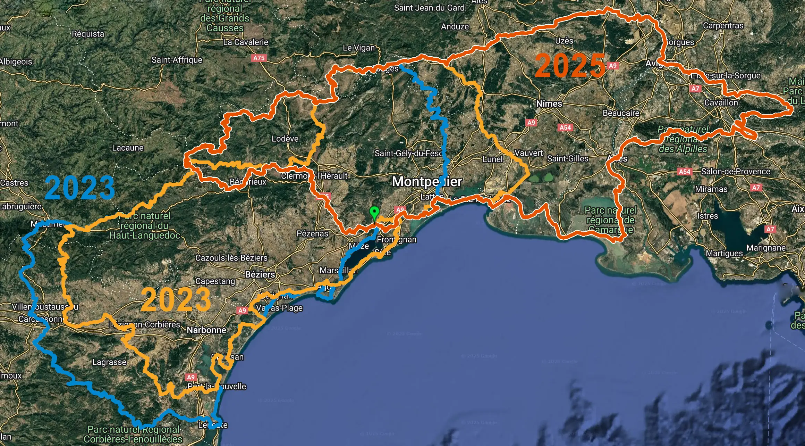
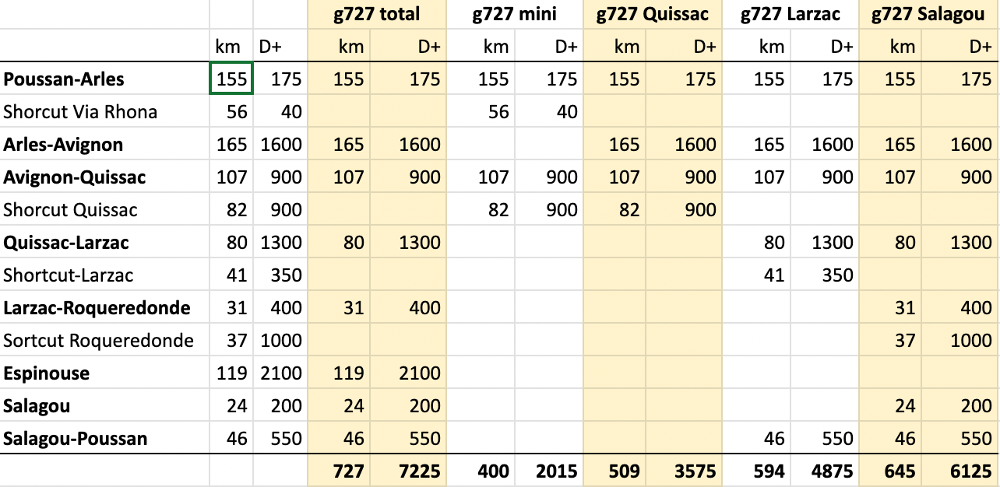

Le g727 est un périple bikepacking pour gravel (mais les VTT sont parfaitement adaptés comme toujours en bikepacking). En plus de l'Hérault, le g727 conduit dans les départements limitrophes. Chaque année, un [Grand Départ](/g727-Grand-Depart/) est donné de Poussan, le dernier samedi de septembre. Au programme, 727 km de pistes et de chemins, avec des variantes moins longues et moins escarpées.

<a href="https://www.helloasso.com/associations/ec-poussan/evenements/g727-2025" class="hotlink">Inscrivez-vous au g727 2025 sur helloasso (35 €) >>></a> (99 places)

[Si vous effectuez le g727 en ITT, vous pouvez nous soutenir…](https://www.helloasso.com/associations/ec-poussan/evenements/don727)

[Poussan se trouve à quelques kilomètres au nord de Sète.](/access/) 

### Carte 2024

<iframe id="visugpx" src="https://www.visugpx.com/CUblYBm7Li?iframe&amp;height=650" style="width:100%;height:650px;border:none;resize: both;" frameborder="0" scrolling="no"></iframe>

<h3 id="gpx">GPX de référence</h3>

* Trace 2025 ([sera dispo quelques jours avant le grand départ du 27 septembre](https://727bikepacking.fr/g727-Grand-Depart/)). Après le massif de la Gardiole, la trace rejoint le Grau-du-Roi, puis Les Saintes-Maries-de-la-Mer et la Camargue, pour remonter vers Arles. Départ en douceur donc le long du littoral. Elle traverse les Alpilles, le Lubéron, puis Rejoint Avignon. De là, nous gagnerons Ganges, retrouvant la trace 2024 qui nous conduira au cirque de Navacelles et au Larzac, puis à Lespinouse, avant de nous faire plonger vers le lac du Salagou et de regagner Poussan, notre point de départ.

* Trace 2024 [Visu GPX avec POI](https://www.visugpx.com/CUblYBm7Li) (mise à jour 3/10/2024), comprend g727 2024, variantes et évitements si inondation ou restrictions risques incendis), [GoogleMap](https://www.google.com/maps/d/edit?mid=1t2FiGpX-LniWK4w9VD-18P-BbwFdB2g&usp=sharing), [KML](/static/g727-20243.kmz), [POI eau pour Garmin](/static/Water_g727-2024.gpx), [statistiques](/static/g727-2024.html), [villes traversées](/static/g727-2024-towns.txt). La trace, à suivre dans le sens anti-horaire, traverse le massif de la Gardiole et se dirige vers le littoral à travers les marais salants de Maguelone. Après la piste le long du canal du Rhône à Sète, elle remonte vers Montpellier et traverse le pays de garrigues jusqu'à Ganges, avant de grimper vers le Larzac pour contourner les gorges de la Vis et le cirque de Navacelles. Après les monts d'Orb, elle plonge vers le lac d'Avène, avant de grimper vers les sommets de l’Espinouse, suivant la piste des crêtes. Une fois au lac de Vézoles, elle oblique vers le Tarn et [la vallée du Thoré](https://www.cc-thoremontagnenoire.fr/tourisme/la-vallee-du-thore). Après [Saint-Amans-Soult](http://www.saint-amans-soult.fr/) et Mazamet, elle attaque le cœur de la montagne Noire avant de rejoindre Carcassonne. Elle se glise au pied de la cité médiévale, traverse les Corbières et enfin rejoint la mer à la hauteur de Leucate. Elle joue alors entre les plages et le massif de la Clape, puis les rives de l'étang de Thau vant de regagner Poussan.

* Trace 2023 : [VisuGPX](https://www.visugpx.com/dgozECS1G4), [GoogleMap](https://www.google.com/maps/d/edit?mid=1DFJ-zW-yUdhOBwaHhx3PJjg6o2HWQrQ&usp=sharing), [KMZ](/static/g727-2023.kmz).

* [Info pour combiner, découper et personnaliser les traces.](/gpx/)

### Équipement

Pensé pour le gravel, le tour exige des pneus au minimum de 42 mm pour avaler les passages caillouteux, et surtout pour offrir un confort suffisant durant plus de 700 km. Si vous pouvez chausser plus gros, n'hésitez pas (50 mm étant un idéal). Bien-sûr, le tour peut s'effectuer dans le plus grand confort avec un monster cross, un monster gravel ou un VTT. Pourcentages parfois sévères, il ne faut pas tirer trop gros. L'idéal étant comme souvent en bikepacking de disposer d'un développement de type VTT.

Des pneus tubeless sont indispensables, les terrains rencontrés tant côté épines que cailloux n'étant pas compatibles avec les chambres à air.

De nombreux points d'eau ponctuent le parcours, deux gourdes de 0,75 l suffisent, voire deux fois 1 l en été. En revanche, il peut être difficile de s'alimenter, donc bien anticiper de ce côté.

Évitez les sacs à dos. Le terrain reste accidenté. Les participants avec des sacs trop imposants abandonnent presque systématiquement. 

### Difficulté

Le tour ne présente aucune difficulté technique, mais essayez d'être le plus léger possible.

### Liens

* [Récit 2024](https://tcrouzet.com/2024/10/03/g727-2024/)

* Vidéo [2023](https://www.youtube.com/watch?v=Bo42Ue6Qtvk&ab_channel=PaTVenture)

* [Récit 2023](https://tcrouzet.com/2023/09/28/g727-une-premiere-lumineusement-intense/)

### Statistiques 2024

<iframe src="/static/g727-2025.html" title="Statistic player" frameborder="0" style="width:100%;height:650px;border:none;" allowfullscreen></iframe>

### Les 129 communes du g727 2025

km0 - Poussan 6.0km

km2 - Montbazin 2.6km

km5 - [Gigean](https://www.ville-gigean.fr/) 5.0km

km10 - [Fabrègues](http://www.ville-fabregues.fr) 2.9km

km13 - Mireval 7.7km

km21 - Villeneuve-lès-Maguelone 9.8km

km21 - Vic-la-Gardiole 0.6km

km31 - [Palavas-les-Flots](https://palavaslesflots.com/) 8.0km

km39 - [Mauguio](https://www.mauguio-carnon.com/) 6.1km

km45 - [La Grande-Motte](https://www.lagrandemotte.fr/) 7.3km

km52 - Le Grau-du-Roi 7.3km

km60 - Aigues-Mortes 9.4km

km69 - Saint-Laurent-d'Aigouze 6.2km

km75 - Saintes-Maries-de-la-Mer 43km

km83 - Vauvert 2.3km

km118 - Arles 41km

km162 - Fontvieille 11km

km167 - Tarascon 0.3km

km173 - Paradou 3.7km

km177 - Maussane-les-Alpilles 1.9km

km178 - Les Baux-de-Provence 4.4km

km183 - Saint-Rémy-de-Provence 11km

km194 - Eygalières 5.2km

km199 - Eyguières 6.7km

km206 - Orgon 2.1km

km208 - Sénas 12km

km220 - Mallemort 5.1km

km225 - Mérindol 4.7km

km230 - Cheval-Blanc 18km

km247 - Oppède 3.5km

km250 - Ménerbes 7.2km

km255 - Lacoste 3.1km

km256 - Bonnieux 11km

km269 - Goult 4.5km

km274 - Beaumettes 2.0km

km279 - Maubec 0.9km

km280 - Robion 6.4km

km287 - Cavaillon 3.7km

km290 - L'Isle-sur-la-Sorgue 6.0km

km296 - Le Thor 3.2km

km298 - Caumont-sur-Durance 2.4km

km302 - Châteauneuf-de-Gadagne 5.2km

km307 - Morières-lès-Avignon 3.1km

km310 - [Avignon](https://www.avignon.fr/) 17km

km327 - Villeneuve-lès-Avignon 0.9km

km328 - Sauveterre 5.7km

km334 - Roquemaure 5.1km

km339 - Montfaucon 3.5km

km342 - Saint-Geniès-de-Comolas 1.7km

km344 - Saint-Laurent-des-Arbres 3.3km

km347 - Saint-Victor-la-Coste 3.3km

km349 - Laudun-l'Ardoise 2.4km

km351 - Saint-Paul-les-Fonts 0.3km

km353 - Connaux 1.5km

km355 - Tresques 4.5km

km359 - Gaujac 1.2km

km360 - Saint-Pons-la-Calm 0.7km

km361 - Le Pin 2.6km

km364 - Pougnadoresse 3.2km

km367 - La Bastide-d'Engras 3.6km

km370 - Saint-Laurent-la-Vernède 1.5km

km372 - Saint-Quentin-la-Poterie 2.4km

km374 - Uzès 0.4km

km375 - Montaren-et-Saint-Médiers 4.6km

km379 - Serviers-et-Labaume 3.6km

km381 - Aigaliers 4.7km

km388 - Foissac 1.9km

km390 - Collorgues 4.3km

km394 - Saint-Dézéry 3.6km

km397 - Saint-Chaptes 1.6km

km399 - Moussac 4.0km

km403 - Sauzet 1.5km

km404 - Saint-Geniès-de-Malgoirès 3.7km

km408 - Mauressargues 3.3km

km411 - Montagnac 7.2km

km414 - Moulézan 3.3km

km418 - Cannes-et-Clairan 4.1km

km422 - Bragassargues 4.3km

km426 - Quissac 5.2km

km431 - Sauve 6.0km

km437 - Conqueyrac 3.3km

km440 - Saint-Hippolyte-du-Fort 6.3km

km447 - La Cadière-et-Cambo 3.4km

km450 - Moulès-et-Baucels 5.3km

km456 - Ganges 2.6km

km458 - Cazilhac 2.0km

km460 - Saint-Laurent-le-Minier 7.3km

km467 - Montdardier 9.4km

km477 - Blandas 15km

km492 - [Saint-Maurice-Navacelles](https://www.stmauricenavacelles.fr/) 16km

km507 - La Vacquerie-et-Saint-Martin-de-Castries 0.9km

km508 - Saint-Michel 7.1km

km515 - Le Cros 4.8km

km520 - Le Caylar 6.1km

km526 - Saint-Félix-de-l'Héras 1.3km

km528 - Les Rives 2.8km

km530 - Lauroux 6.7km

km537 - Roqueredonde 11km

km548 - Ceilhes-et-Rocozels 10km

km558 - Avène 23km

km581 - Mélagues 22km

km586 - [Saint-Gervais-sur-Mare](https://www.stgervaissurmare.fr/) 0.2km

km604 - Arnac-sur-Dourdou 1.9km

km606 - Castanet-le-Haut 12km

km614 - Cambon-et-Salvergues 0.2km

km618 - Rosis 13km

km631 - Combes 3.8km

km634 - [Lamalou-les-Bains](http://www.lamalou-les-bains.fr) 6.4km

km641 - Hérépian 1.7km

km643 - Villemagne-l'Argentière 0.2km

km643 - [Bédarieux](http://www.bedarieux.fr) 9.3km

km652 - La Tour-sur-Orb 3.6km

km656 - Carlencas-et-Levas 4.4km

km660 - Brenas 4.7km

km665 - Octon 8.9km

km674 - Liausson 4.3km

km678 - Clermont-l'Hérault 9.2km

km687 - Villeneuvette 1.1km

km688 - Nébian 3.0km

km691 - Lieuran-Cabrières 2.2km

km693 - Aspiran 5.6km

km699 - [Paulhan](https://www.paulhan.fr/) 2.7km

km699 - Bélarga 0.6km

km702 - Campagnan 2.3km

km705 - [Saint-Pargoire](http://www.ville-saintpargoire.com) 1.0km

km706 - Saint-Pons-de-Mauchiens 5.3km

km715 - Mèze 4.4km

km719 - Villeveyrac 4.5km

km724 - Loupian 2.8km

